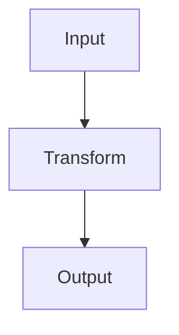
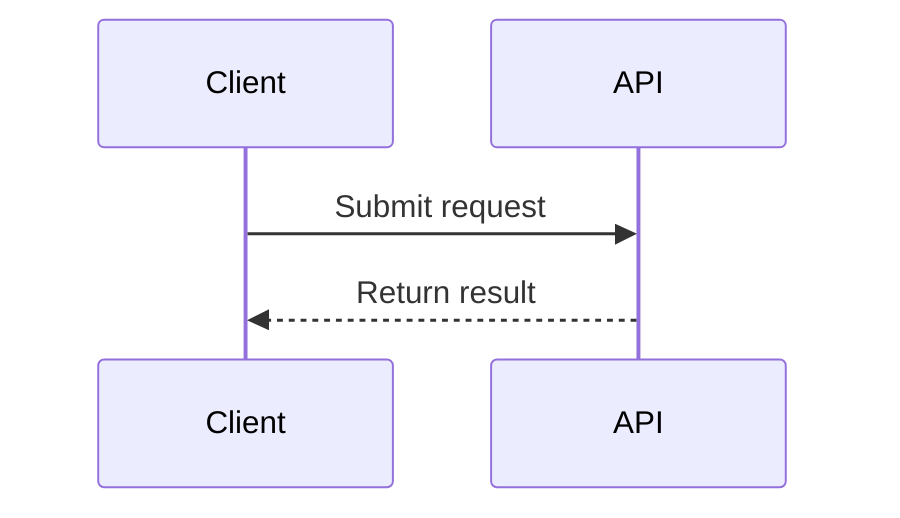
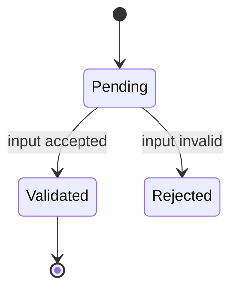
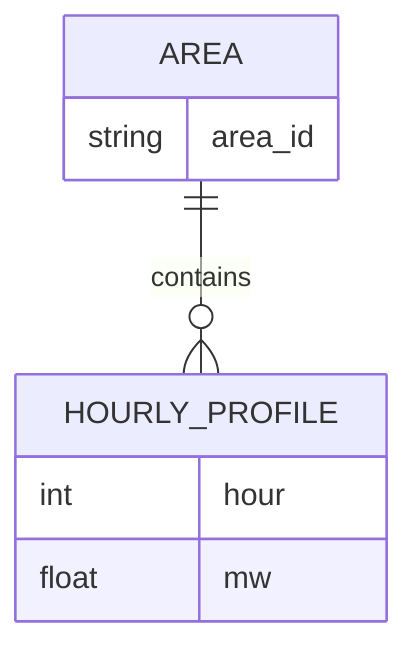
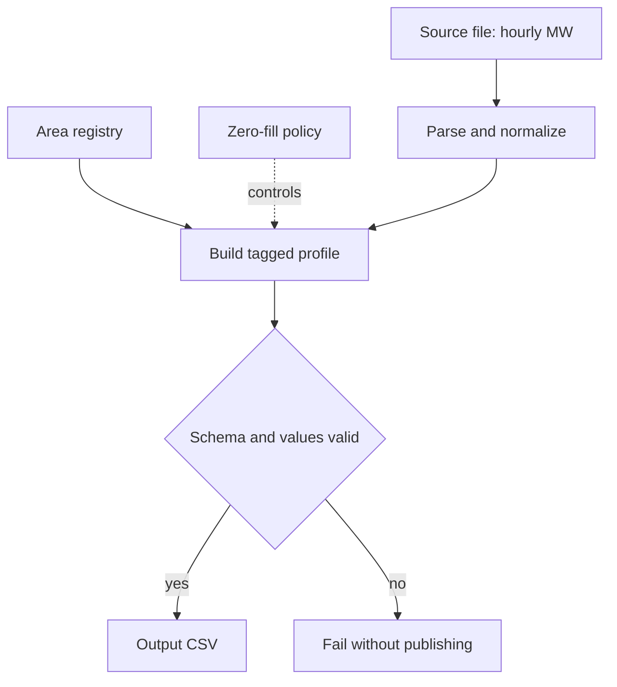
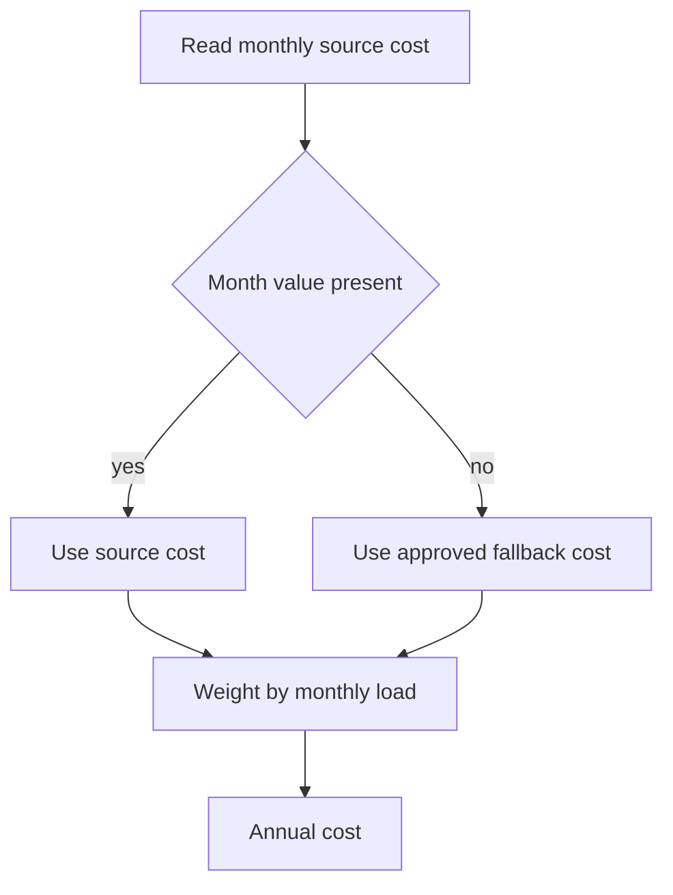
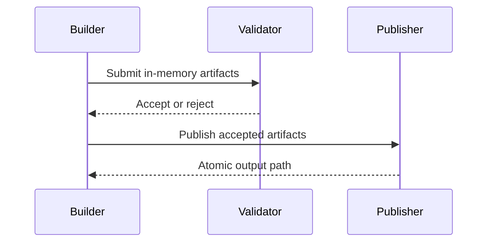

# Mermaid Chart Authoring

Create Mermaid diagrams that explain a system's decisions, transformations, and
outputs without copying implementation syntax into a chart. This is reference
material: use it deliberately for a documentation or explanation task.

## Workflow

1. Identify the reader's question: flow of work, message order, data shape,
   state changes, schedule, hierarchy, or comparison.
2. Identify the diagram boundary. Include inputs, key decisions, transformations,
   outputs, and failure paths; omit helper functions and incidental plumbing.
3. Select one chart type using the selection rules below.
4. Translate code into domain-level stages. Use verbs for transformations and
   nouns for data stores, files, external systems, or output artifacts.
5. Write the smallest complete diagram. Add a second focused diagram rather than
   making one diagram carry unrelated detail.
6. Check syntax and rendering-safety rules before publishing.
7. Put narrative details, fields, units, assumptions, and formulas in nearby
   Markdown tables or prose. Do not force them into node labels.

## Chart Selection

| Reader needs to understand | Preferred chart type | Avoid when |
| --- | --- | --- |
| Ordered transformation, ETL, build, validation, or branching algorithm | `flowchart` | The important fact is time-ordered interaction between participants. |
| Request/response or asynchronous interaction between named participants | `sequenceDiagram` | There is no meaningful message order. |
| Object, entity, module, package, or ownership relationships | `classDiagram` | The relationships are really execution steps. |
| Legal states and transitions | `stateDiagram-v2` | Nodes are merely workflow stages, not persistent states. |
| Project phases, dates, and dependencies | `gantt` | Exact calendar scheduling is not required. |
| Record/entity relationships and cardinality | `erDiagram` | Modeling code inheritance or behavior. |
| Commit, branch, release, or merge history | `gitGraph` | Explaining the current system pipeline. |
| Hierarchical taxonomy or decomposition | `mindmap` | Showing execution order or branching. |
| Proportional contribution or simple comparison | `pie` / Markdown table | The audience needs an algorithm or dependency graph. |

Default to `flowchart TD` for a top-to-bottom algorithm and `flowchart LR` for a
short left-to-right pipeline. Use `TD` when labels are longer than a few words
or when the diagram has decisions and fan-out.

## Mermaid Commands

Start every diagram with a fenced Markdown block and a diagram declaration:

```markdown

```

Common flowchart commands:

| Syntax | Meaning |
| --- | --- |
| `flowchart TD` | Top-down directed graph. |
| `flowchart LR` | Left-to-right directed graph. |
| `A[Label]` | Rectangular process or artifact node. |
| `D{Question}` | Decision node. |
| `S[(Store)]` | Data store or persistent source. |
| `A --> B` | Directed connection. |
| `A -->|condition| B` | Directed connection with a concise edge label. |
| `A -. optional .-> B` | Dotted optional or non-default connection. |
| `subgraph Name` ... `end` | Bounded subsystem or ownership group. |
| `%% comment` | Mermaid comment. |

Useful declarations:







## Translate Code Into High-Level Algorithms

Use code to discover behavior, then remove implementation-only detail.

| Code element | Diagram representation |
| --- | --- |
| Function that parses an external file | Input node plus `Parse`/`Normalize` process. |
| DataFrame/table/object returned by a function | Named normalized-data or artifact node. |
| `if`/`match`/validation guard | Decision diamond with pass and fail paths. |
| Loop over areas, hours, files, or records | One aggregate stage: `For each area`, `Repeat for every hour`, or `Apply to all records`. |
| `groupby`, `merge`, `pivot`, `join` | `Aggregate`, `Join`, or `Pivot` process node, with source inputs. |
| Policy/configuration constant | Separate policy input node, preferably dotted to the transformation it controls. |
| Exception | Terminal `Fail validation` node when it affects the documented contract. |
| File write | Output artifact node. |
| Unit test | Omit from the production algorithm; describe it in prose or a separate validation diagram. |

### Abstraction Rules

- Preserve domain decisions: selection criteria, mappings, joins, fallback rules,
  validation gates, unit conversions, and output contracts.
- Collapse repeated mechanics. `for record in records` is not useful unless the
  iteration order or aggregation changes meaning.
- Name data by its business meaning, not its local variable name. Prefer
  `Monthly load MWh` over `monthly_load_mwh` when the label remains precise.
- Show a single direct path for the normal case and only failure branches that
  explain why data cannot be published.
- For an output group, show all source inputs feeding the builder and every
  resulting artifact leaving it.
- When a pipeline has many stages, use an overview diagram plus one diagram per
  output group. Keep each diagram focused on one answerable question.

## Worked Examples

### Source-To-Artifact Pipeline

Use this for a file-backed transformation with policy and validation.



### Conditional Fallback

Use a decision label that answers yes/no. Put the action on edges.



### Interaction Rather Than Data Flow

Use a sequence diagram when the timing/order between actors matters.



## Rendering-Safe Practices

- Use a ` ```mermaid ` fenced code block exactly; close it with ` ``` `.
- Declare the diagram type on the first Mermaid line.
- Give every node a unique ASCII identifier such as `Load`, `Validate`, or
  `Output1`; place human-readable text only in labels.
- Keep labels short. Move file fields, units, formulas, and long conditions to a
  nearby table. Prefer `Apply monthly overrides` over a sentence-length label.
- Use ASCII punctuation in labels where possible. Parentheses, commas, slashes,
  colons, braces, quotes, HTML, and unescaped special characters can make
  renderers fragile; simplify labels before adding escaping.
- Quote or simplify labels containing characters with Mermaid grammar meaning.
  A safe alternative is to move the detail out of the node.
- Use consistent direction, tense, and vocabulary. Process labels start with a
  verb (`Parse`, `Join`, `Validate`); artifact labels are nouns (`areas.csv`).
- Use edge labels only for meaningful conditions such as `yes`, `no`, `missing`,
  or `selected year`; do not label every arrow.
- Keep graphs acyclic unless feedback is central to the system. If feedback is
  central, use a state or sequence diagram where it is clearer.
- Keep subgraphs shallow. One level is usually sufficient.
- Split diagrams that require excessive crossing edges, tiny labels, or more
  than one main question.
- Verify every source and output label against the documented or implemented
  contract before publishing.

## Anti-Patterns

| Anti-pattern | Why it fails | Better approach |
| --- | --- | --- |
| One node per line of code | Creates an unreadable flowchart and hides the algorithm. | Collapse code into parse, validate, transform, and emit stages. |
| Diagramming every helper | Obscures the owning data flow. | Show only helpers that change domain meaning or validation. |
| Large paragraph labels | Cause overflow and unreliable layout. | Use a concise node plus a table/numbered steps beside it. |
| Ambiguous diamonds | Readers cannot tell what yes/no means. | Phrase as a Boolean question, e.g. `Profile complete?`. |
| Omitting failure gates | Suggests invalid data is silently published. | Add a clear `Fail validation` terminal when behavior matters. |
| Mixing time, ownership, and data shape in one chart | Forces incompatible semantics into one notation. | Use separate sequence, flowchart, and ER/class diagrams. |
| Invented fields, units, or mappings | Produces attractive but inaccurate documentation. | Trace claims to source readers, builders, tests, or verified source docs. |
| Unicode arrows or decorative glyphs in labels | Can render inconsistently across Mermaid environments. | Use Mermaid edges and plain ASCII labels. |
| Styling before correctness | Adds syntax risk without improving explanation. | First verify a minimal unstyled chart; style only when established locally. |

## VS Code And GitHub Verification

Use the common Mermaid subset when a document must render in both VS Code and
GitHub: `flowchart`, `sequenceDiagram`, `stateDiagram-v2`, `erDiagram`, basic
nodes/edges, and simple labels. Avoid experimental diagram types, HTML labels,
custom initialization directives, custom themes, and complex CSS styling unless
the target renderer has been verified.

1. In VS Code, open the Markdown Preview and confirm that every Mermaid block
  renders, labels remain readable, and the diagram is not clipped.
2. Inspect the raw Markdown to ensure fences are balanced and the declaration
  immediately follows each ` ```mermaid ` line.
3. For a GitHub PR or README, inspect the GitHub-rendered Markdown before
  relying on the diagram. A diagram rendering locally is not proof that the
  GitHub renderer accepts it.
4. If a renderer fails, reduce to an unstyled `flowchart TD` with short ASCII
  labels, then restore only the syntax that has been shown to render.

## Pre-Publish Checklist

- [ ] The chart type matches the reader's question.
- [ ] The title, nearby table, and diagram describe the same scope.
- [ ] Input sources, transformations, policy controls, validation, and outputs
      are represented at the right abstraction level.
- [ ] Node identifiers are unique and labels are concise.
- [ ] Every decision has clear outgoing conditions.
- [ ] Field names, units, and mappings are verified by evidence.
- [ ] The Mermaid fence, declaration, node syntax, and connections are complete.
- [ ] The diagram has been rendered in the target Markdown viewer.
- [ ] For shared documentation, the diagram has been checked in both VS Code
  preview and the GitHub-rendered Markdown.
- [ ] A complex system is split into an overview and focused sub-diagrams.
