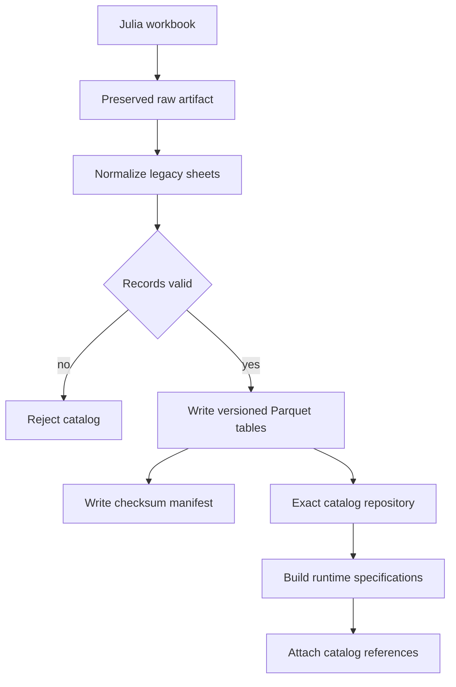
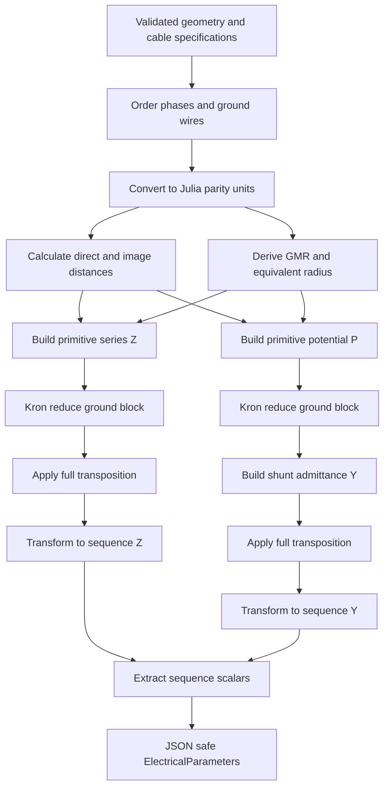

# Electrical parity and reference catalog

This document describes the implemented Julia-parity path and the normalized
catalog artifacts used by the parity tests. Calculations consume validated
runtime models; only the catalog builder reads the preserved workbook.

## Workbook to runtime catalog

The generated `data/catalog/v1` tables are:

| Table | Runtime meaning | Important units |
| --- | --- | --- |
| `tower_geometries` | Structure identity and topology | kV, circuit and wire counts |
| `phase_positions` | Circuit phase coordinates | feet |
| `ground_wire_positions` | Ground-wire coordinates | feet |
| `conductors` | Phase conductor electrical source fields | inches, ohm/kft, Mohm/kft |
| `ground_wires` | Ground-wire source fields | inches, ohm/kft |
| `states`, `state_borders` | Exact state identity and adjacency | identifiers |
| `actual_lines` | Preserved workbook line records | source units |

## Electrical calculation algorithm

### Optional parity capacitance radius

`BareConductorEquipment.capacitance_radius` is an optional parity-only field.
The catalog builder derives it from `C_60Hz_Mohm_kft` using the Julia
capacitance-radius equation. It is not a user override and is absent when the
source field is unavailable. Bundle derivation prefers this radius for the
potential matrix and falls back to physical conductor diameter for general
runtime data. Ground wires remain unbundled and use their physical radius.

The parity contract is retained at the calculation boundary:

- coordinates, distances, GMR, and equivalent radius: feet;
- bundle spacing and diameter: inches;
- resistance input: ohm/kft;
- series impedance: ohm/mile;
- shunt admittance: microsiemens/mile;
- voltage: kV; and
- SIL: MW.

The implementation retains the Julia constants `R_CONST = 0.00158836`,
`L_CONST = 0.00202237`, `L_FACTOR = 7.6786`, and
`EPSILON_AIR = 1.4240e-2`, including the Julia frequency and mile/kft factors.

## Runtime ownership

Calculation modules do not read workbook or Parquet files and do not mutate
components. Catalog access and runtime-model construction remain in the
catalog and builder layers respectively.
