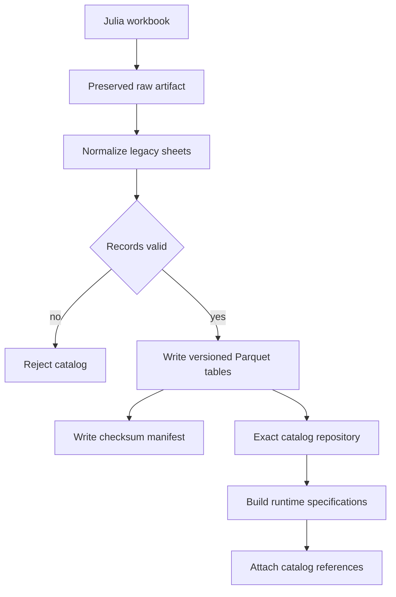
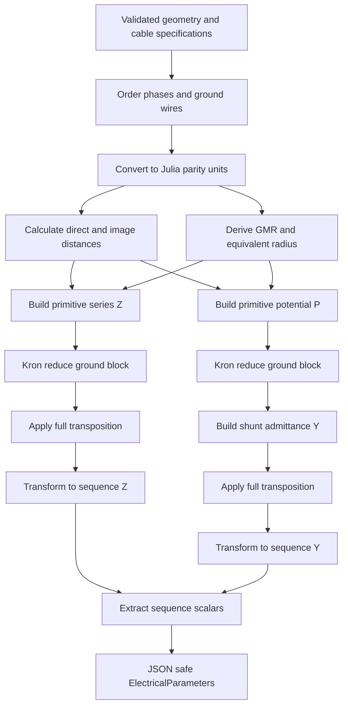
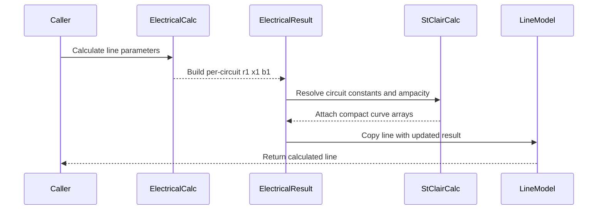
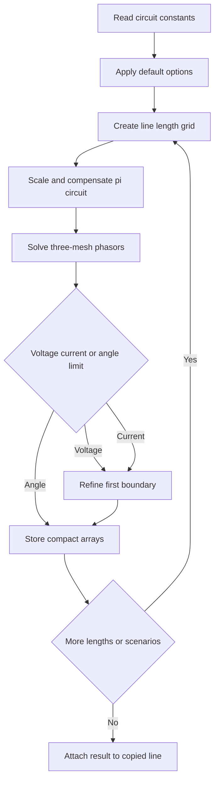
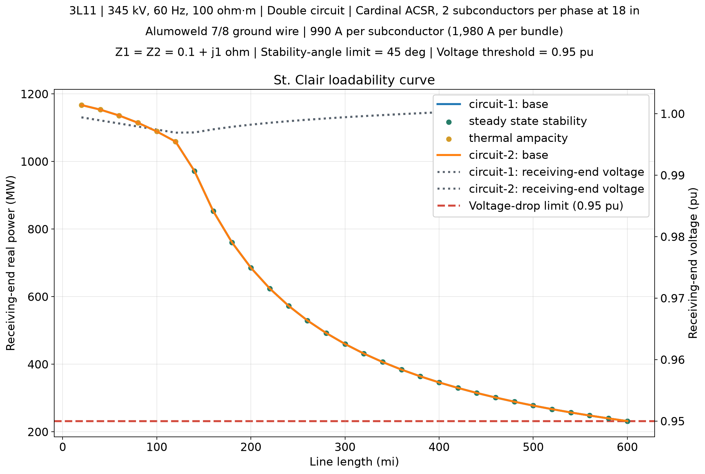
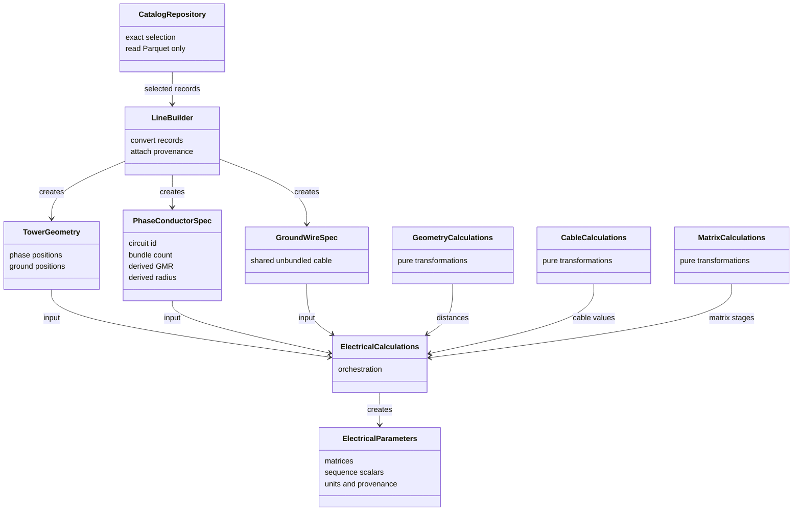

# Electrical parity and reference catalog

This document describes the implemented Julia-parity path and the normalized
catalog artifacts used by the parity tests. Calculations consume validated
runtime models; only the catalog builder reads the preserved workbook.

## Workbook to runtime catalog



The generated `data/catalog/v1` tables are:

| Table | Runtime meaning | Important units |
| --- | --- | --- |
| `tower_geometries` | Structure identity and topology | kV, circuit and wire counts |
| `phase_positions` | Circuit phase coordinates | feet |
| `ground_wire_positions` | Ground-wire coordinates | feet |
| `conductors` | Phase conductor electrical source fields | inches, ohm/kft, Mohm/kft |
| `ground_wires` | Ground-wire source fields | inches, ohm/kft |
| `states`, `state_borders` | Exact state identity and adjacency | identifiers |
| `actual_lines` | Preserved workbook line records | source units |

## Electrical calculation algorithm



## St. Clair loadability curves

The St. Clair solver reuses each circuit's calculated positive-sequence `r1`, `x1`, and `b1`. It uses natural units internally: volts, ohms, ohm/mile, siemens/mile, amperes, watts, and miles. Electrical calculations persist `b1` in microsiemens/mile, which is multiplied by `1e-6` at the solver boundary. The resolved source magnitudes are `E1 = abs_e1_pu * V_nominal_LL` and `E2 = abs_e2_pu * V_nominal_LL`; phase voltages are used only inside the balanced three-mesh solution. No MVA base is used.

Defaults are `abs_e1_pu = abs_e2_pu = 1.0`, `r_system_1_ohm = r_system_2_ohm = 0.1 ohm`, `x_system_1_ohm = x_system_2_ohm = 1.0 ohm` (so `Z1 = Z2 = 0.1 + j1 ohm`), zero sending/receiving/series compensation, a 0.95 receiving-voltage limit, a 45-degree (`pi/4`) stability-angle limit, and a 0.5-degree angle step. The Thevenin values are natural-unit impedances, not per-unit values. Angle values remain degrees in options and results and convert to radians only at the NumPy exponential boundary. Positive series compensation reduces line reactance; sending and receiving shunt compensation are applied independently and may differ.

For each length, the solver scans increasing sending-system angle and retains the first voltage, ampacity, or stability boundary. Voltage and thermal crossings are refined by bisection. The angle grid always includes the exact configured stability limit, even when the angle step does not divide that limit evenly; the stability boundary is that configured angle and is not interpolated. Equality is a limit. Direct positive-sequence inputs must provide conductor ampacity (`conductor_ampacity_a` or its `ampacity_a` alias) so the thermal limit is explicit. A bundled circuit's current limit is conductor ampacity multiplied by its subconductor count, and its thermal reference is `sqrt(3) * V_nominal_LL * I_circuit_nominal / 1e6` MW. Two-circuit lines use separate sequence-matrix diagonal values and separate conductor ratings; mutual coupling is not included in the curves. The model is balanced and steady-state, not transient stability or fault analysis.





Every line-level electrical calculation attaches the default St. Clair result. Explicit recalculation and sensitivity studies use `calculate_st_clair_curve`; mapping input uses natural-unit constants, while a line input returns a copied line. Plotting is optional and consumes stored results:

```python
from transmissionlines.api import calculate_st_clair_curve, plot_st_clair_curve

updated_line = calculate_st_clair_curve(line)
result = updated_line.line_parameters.electrical_parameters.st_clair_curve
axes = plot_st_clair_curve(result, curves="all")
```

With `show_voltage_limit=True`, the plot adds receiving-end voltage in per unit
on a secondary axis and draws the configured voltage-drop threshold. This is
the voltage at each point on the selected loadability curve, not a separate
voltage-limited MW curve. The threshold may remain nonbinding when stability
or ampacity sets the active power boundary.

This example uses the `3L11` fixture from
[`test_electrical_parity.py`](../test/calculations/test_electrical_parity.py):
345 kV, 60 Hz, 100 ohm*m earth resistivity, two Cardinal ACSR subconductors
per circuit at 18-inch spacing, and an Alumoweld 7/8 ground wire. The catalog
rating is 990 A per subconductor (1,980 A per circuit bundle). Circuit 1's
tested positive-sequence values are `r1 = 0.06041707268316814` ohm/mile,
`x1 = 0.571814216468555` ohm/mile, and `b1 = 7.540921284378496`
microsiemens/mile. Each curve uses its own circuit's calculated sequence
values; the curves nearly overlap because the two circuits have the same
geometry and conductor specifications. Mutual coupling is not represented.

For a voltage comparison, the optional secondary axis plots receiving-end
voltage and its 0.95 pu threshold:



This comparison keeps the same test fixture, uses the default Thevenin
impedances `Z1 = Z2 = 0.1 + j1 ohm`, and sets the stability-angle limit to
45 degrees. The MW curves use
the left axis; the receiving-voltage profiles and 0.95 pu threshold use the
right axis. The voltage profiles stay above the threshold, so ampacity or
steady-state stability remains the active limit.

Install plotting support with `pip install transmissionlines[plot]`. Numerical calculation and result serialization do not require Matplotlib. Compact curves store parallel arrays rather than one model object per angle or length sample.

### Optional parity capacitance radius

`BareConductorEquipment.capacitance_radius` is an optional parity-only field.
The catalog builder derives it from `C_60Hz_Mohm_kft` using the Julia
capacitance-radius equation. It is not a user override and is absent when the
source field is unavailable. Bundle derivation prefers this radius for the
potential matrix and falls back to physical conductor diameter for general
runtime data. Ground wires remain unbundled and use their physical radius.

The result model stores canonical Julia names such as `Zabcg`, `Z_kron_nt`,
`Z012_nt`, `Z_kron_ft`, and `Z012_ft`. The original short names
`Z_primitive`, `P_primitive`, `Z_kron`, `Z_transposed`, and `Z_sequence` remain aliases for the non-transposed
Kron matrix, fully transposed Kron matrix, and fully transposed sequence matrix
respectively; equivalent Y and P aliases are also retained.

The parity contract is retained at the calculation boundary:

- coordinates, distances, GMR, and equivalent radius: feet;
- bundle spacing and diameter: inches;
- resistance input: ohm/kft;
- series impedance: ohm/mile;
- shunt admittance: microsiemens/mile;
- voltage: kV; and
- SIL: MW.

The implementation retains the Julia constants `R_CONST = 0.00158836`,
`L_CONST = 0.00202237`, `L_FACTOR = 7.6786`, and
`EPSILON_AIR = 1.4240e-2`, including the Julia frequency and mile/kft factors.

## Runtime ownership



Calculation modules do not read workbook or Parquet files and do not mutate
components. Catalog access and runtime-model construction remain in the
catalog and builder layers respectively.
