# PDF-backed conductor catalog migration plan

Status: PDF adapters and in-memory, unpublished strength/area staging are implemented. No catalog, model, or generated data is changed by this staging work. The approved mechanical-area policy supports the separate sag integration plan; it does not supply sag's effective elastic modulus or thermal-expansion coefficient, which belong in `SagOptions`.

The staging boundary is `stage_sources` in `src/transmissionlines/catalog/conductor_staging.py`, followed by `resolve_areas` in `src/transmissionlines/catalog/mechanical_area.py`. Both accept extracted PDF rows and return candidates plus row-keyed issues; neither writes files or changes the v1 catalog. Strengths without a printed numeric cell do not become candidates. Geometry pages 3 and 5 of the HS285 TW source become distinct shaped-wire candidates; their electrical pages remain extracted source rows for a later join. ACCC ULS shares the row's printed standard weight as an explicitly labeled approximation and assumes its listed core diameter applies to ULS area. Area comparison currently allows 2% plus 0.0002 in2 printed precision against round-wire strand geometry, flags TW source differences over 0.0002 in2, and checks the outside-diameter envelope with 1% precision allowance. Conflicts, missing inputs, and rejected transfers remain in the in-memory issue report for review before publication.

## Scope and source inventory

Keep `data/catalog/v1` immutable. Build a new versioned catalog from the PDFs under `data/raw/conductors/`, preserving unrelated geometry, state, line, and ground-wire tables. The current v1 workbook adapter in `src/transmissionlines/catalog/importer.py` generates 161 conductor rows, with order-dependent IDs. The replacement must not mislabel legacy workbook values as manufacturer data.

| Input PDF | Section and PDF pages (1-based) | Intended use |
| --- | --- | --- |
| `southwire/AAC.pdf` | Inspect table and units before mapping | AAC candidate source; do not delete AAC merely because AAAC and ACAR are excluded. |
| `southwire/ACSR.pdf` | Round-wire tables, pp. 2-3 | ACSR dimensions, weight, rated strength, resistance, and 75 C ampacity. |
| `southwire/ACSR_AW.pdf` | Round-wire tables, pp. 2-3 | ACSR/AW dimensions, weight, rated strength, resistance, and 75 C ampacity. |
| `southwire/ACSR_TW.pdf` | **Area Equal to Standard ACSR Sizes**, pp. 2-3 | Published total-area candidates for codeword/size joins; do not import shaped-wire dimensions or strength as round-wire properties. |
| `southwire/ACSS.pdf` | Round-wire tables, pp. 2-3 | ACSS standard, high, and HS285 strength columns, dimensions, weight, resistance, and ampacity with stated temperature. Use this source for round-wire HS285 values. |
| `southwire/ACSS TW.pdf` | **Area Equal to Standard ACSR Sizes**, pp. 2-3 | Additional published total-area candidates; verify header positions independently of ACSR/TW. |
| `southwire/ACSS Hs285.pdf` | Shaped-wire *Area Equal to ACSS* pp. 3-4 and *Diameters Equal to ACSR* pp. 5-6 | Stage TW layouts only, preserving each published strength grade and each table's geometry/electrical provenance. Do not use the PDF's round-wire pp. 7-10: round-wire HS285 strengths already come from `ACSS.pdf`. Do not infer a codeword for the unnamed first equal-diameter row. |
| `ACCC_electrical_data_ctc.pdf` | US customary table, p. 1 | ACCC standard rows and ULS rows with numeric ULS rated strength; aluminum kcmil, core diameter, approximate weight, strength, resistance, ampacity and footnote. |

Exclude AAAC and ACAR from the new conductor catalog by policy, even though source files exist. Audit AAC separately against its PDF, retaining it only with validated source mappings (otherwise report its migration status instead of silently carrying over workbook measurements). Retain ACCC and the 20 ULS variants whose ULS strength is numeric; do not manufacture ULS records for blank/dash strength cells. Confirm all family and variant counts from source tables during implementation, including AWG `1/0` and differing textual forms of equal numeric sizes.

## Extraction, identity, and provenance

1. Pin immutable PDF paths and SHA-256 checksums in the manifest and `sources` table. Declare a PDF extraction dependency (for example PyMuPDF) if the build must run from PDFs; keep a reviewed, machine-readable extraction fixture with stable row keys for audit, not a manual replacement for the PDFs. Store the parser version and extraction mapping version.
2. Define one adapter per PDF layout/section. Explicitly map stacked headers and units by page and table, trim continuation/header/footer/footnote rows, join wrapped codewords, and parse numeric cells with commas, blank cells, dashes, AWG sizes, and variant labels. Never use a bare numeric column offset across different PDFs. Convert resistance in ohm/mile to ohm/kft only for columns labeled that way; preserve each AC resistance temperature and ampacity temperature rather than renaming to 75 C. Source files with resistance already in ohm/1000 ft need no conversion.
3. Stage extracted rows with `source_file`, checksum or `source_id`, PDF page/section/table, raw codeword/size, variant/strength class, source header, raw cell value and unit. Keep column-level provenance for derived or transferred properties: a record-level source alone cannot explain an area from another PDF, or an estimated ULS weight. Review any ambiguous table segmentation or split cell against the rendered page.
4. Normalize family, codeword (strip only known `/TW`, `/ACSS`, `/Aw` suffixes for **join keys**), size as exact decimal kcmil or canonical AWG, and explicit variant (`standard`, `high`, `hs285`, `uls` as applicable). Preserve the displayed source spelling separately. Use a deterministic family/size/codeword/variant/construction-based `record_id`, never parser row order; detect collisions rather than suffixing with row index. `source_id` should identify a real source artifact or row, not merely repeat a codeword.
5. Emit normalized Parquet and a reproducible manifest with ordered columns, checksums, row counts, schema/catalog version, normalization/conversion rules, and explicit per-field provenance (either a compact sidecar table keyed by record ID and field or equally queryable metadata). Avoid generation timestamps unless caller supplied. Distinguish published, calculated, cross-PDF transferred, and assumed values.

```mermaid
flowchart LR
    PDFs[Checked PDF sources] --> Adapters[Page and section adapters]
    Adapters --> Staging[Auditable source rows and units]
    Staging --> Variants[Normalize keys and strength variants]
    Variants --> Area[Resolve and check area provenance]
    Area --> Models[Validate conductor records]
    Models --> Catalog[New Parquet catalog and manifest]
    Catalog --> Repository[Exact repository selection]
    Repository --> Builder[Conductor equipment with catalog reference]
```

## Mechanical area policy

Area is **material cross-sectional area**, excluding inter-strand voids; it is not the circular area enclosed by overall conductor diameter. Keep aluminum area, core area, and total material area separately where available, with units in square inches. Area transfer from a TW reference is a documented lookup policy, not proof of identical round and shaped-wire construction.

- For round ACSR and ACSR/AW, prefer a codeword-and-size match from the *Area Equal* ACSR/TW table; for round ACSS prefer ACSS/TW. If the corresponding family's TW table lacks the key but the other has it, treat the other as a candidate only after comparing against the source round-wire geometry. Record both source areas and their discrepancy if both exist; never silently average or select by extraction order. The 37 overlapping TW keys include seven differing published total areas (Scoter, Chukar, Finch, Oriole, Hen, Linnet, Bluebird). Set a documented numerical comparison tolerance in tests and quarantine any geometrically incompatible cross-construction match rather than silently accepting it.
- In the preliminary PDF scan of round-wire ACSR (68 rows), ACSR/AW (61), and ACSS (64), the two equal-area tables match 88 of 193 rows by normalized name/size: ACSR 34, ACSR/AW 23, ACSS 31. That leaves 105 without a TW match (34, 38, and 33 respectively). These counts are candidate joins, **not** verified equivalent-construction counts; recalculate after full parsing, verification, and strength-variant deduplication. The ACSS/TW source adds four source-row matches versus ACSR/TW alone.
- For the 105 unmatched round-wire source rows, derive material area from **that row's own** published strand counts and individual aluminum and core-wire diameters, not from overall cable diameter: $A=\frac{\pi}{4}(n_{Al}d_{Al}^2+n_{core}d_{core\ wire}^2)$. Parse `Al/Stl`, `Al/Aw`, and `Al/St` counts according to the source; where the core layout/diameter is not a single uniform wire, do not extrapolate an unverified strand diameter. Store input cells, units, formula, output precision, and `derived` provenance; flag a row missing any required input instead of filling it with a TW or workbook guess.
- For ACCC, derive $A_{Al}=S_{kcmil}\pi\,10^{-3}/4$ in square inches and $A_{core}=\pi d_{core}^2/4$, then $A_{total}=A_{Al}+A_{core}$. The PDF lists aluminum size and ACCC core diameter but **not** published total material area. Keep the aluminum and composite-core parts distinct, and do not call this a metallic area. For a ULS row, reuse the standard row's derived area with an explicit **assumption that the listed core diameter applies to ULS**, plus an assumption/provenance flag; the PDF does not give a ULS-specific core diameter. Verify $A_{total}\leq\pi D_{conductor}^2/4$ allowing only justified precision tolerance, never use that outside-diameter circle as material area.

## Variants, other gaps, and electrical data

### Agreed decision: ACCC ULS is a variant

Use `family=ACCC` with `variant=standard` or `variant=uls` in the new catalog. Do not create a separate `ACCC ULS` family or mix both identity schemes within one catalog version. This decision governs stable IDs, exact selectors, and the v1 crosswalk.

| Model | Advantages | Costs |
| --- | --- | --- |
| One ACCC family, explicit `variant=standard|uls` (agreed) | Family queries include both constructions; a shared ACCC PDF row can provide standard and ULS strength while retaining one source lineage; the same variant axis handles ACSS standard/high/HS285; `family`, `variant`, and stable ID remain independently queryable. | `family=ACCC` plus codeword/size can be ambiguous; callers must select `variant` or exact `record_id`. Some displays need a formatted label such as "ACCC ULS". |
| Separate `ACCC` and `ACCC ULS` families | Simple exact family filters can distinguish ULS without a second selector; the catalog's family labels directly match a user-facing product label. | Family stops consistently describing construction while ACSS strength still needs a variant; "all ACCC" requires two-family filtering; duplicated extraction/normalization and copied ULS assumptions become easier to miss; old-to-new ID mapping and cross-family queries become more complex. |

Render `variant=uls` with a derived **display label** "ACCC ULS" for UI and reports; do not encode the same strength choice redundantly in `family`. Selecting `family=ACCC` alone includes both variants, so require an explicit variant or exact `record_id` when codeword and size otherwise match more than one row; never silently default to standard.

- ACCC: import 28 standard rows and only the 20 rows with numeric ULS rated strength, keyed as separate variants. Copy standard total weight to ULS as a **documented approximation** because the footnote says ULS core/total weight is slightly lower; retain the standard published weight and the footnote as provenance. Keep the ULS strength separately. Do not interpret legacy `26/0`-style workbook stranding as manufacturer-reported ACCC stranding; leave unknown when the PDF lacks it. Keep resistance and ampacity conditions from their column headings (75/180/200 C ampacity, 20 C DC and 25/200 C AC resistance) rather than treating each as a single undifferentiated number.
- ACSS: distinguish standard, high, and HS285 strength **per published round-wire row** from `ACSS.pdf`. Record grade, distinct RBS, weight/geometry if given, and rating temperature; avoid cross-product generation. Keep the shaped-wire rows from `ACSS Hs285.pdf` pp. 3-6 as distinct TW source data, not as duplicate round-wire variants; do not extract its round-wire pp. 7-10. On conflicting measured values in the sources used, retain provenance and queue source-specific review instead of choosing an arbitrary preferred PDF. Explicitly identify unsupported variants and absent cells in the audit report.
- ACSR/AW core material is aluminum-clad steel, not generic steel; validate strand count and diameter against its own header. AAC has no steel core; map its own layout when inspected. No material modulus, coefficient of thermal expansion, or conductor-specific effective composite modulus is published in these tables; leave them out of the catalog and require them from `SagOptions`. Do not derive RBS from weight or ampacity from another temperature. Keep every missing mechanical/electrical cell nullable with a documented reason; sag rejects incomplete required weight/RBS/area at its boundary.

## Schema, code, and compatibility work

| Existing surface | Proposed change and compatibility guard |
| --- | --- |
| `src/transmissionlines/catalog/schemas.py` | Extend `ConductorRecord` with explicit variant/strength class, weight lb/kft, RBS lb, aluminum/core/total material area in in$^2$, source conditions for ampacity and resistance, and optional ACCC core diameter. Keep unknown fields nullable; preserve v1 load behavior or gate new required metadata by schema version. Avoid assigning a false `stranding`. |
| `src/transmissionlines/catalog/importer.py` | Leave `generate_julia_workbook_catalog` for v1 reproduction. Add separate PDF adapters and an orchestrated build for the next version. Do not pass PDFs through the generic CSV/Excel `_read` path; use explicit, tested mapping and provenance. |
| `src/transmissionlines/catalog/repository.py` | Keep `select_exact` behavior. Add documented exact selectors for family, codeword, size, variant and/or `record_id`; intentionally fail with `AmbiguousCatalogMatch` when variant is omitted and multiple variants match. Do not silently choose standard or ULS. |
| `src/transmissionlines/builders/line.py`, `src/transmissionlines/models/cables.py`, `src/transmissionlines/units.py` | Convert supported weight, RBS, total material area into unit-typed optional `BareConductorEquipment` fields. Do not add modulus or thermal expansion to equipment. Require full mechanical inputs only when calculating sag; preserve existing electrical construction for v1 records. |
| `src/transmissionlines/catalog/validation.py`, catalog tests | Check source checksums, schema/version, unique deterministic IDs, manifest/Parquet parity, source and field provenance, variant keys, unit ranges, geometrical consistency, and historical v1 load. |
| `data/catalog/README.md`, `docs/source/concepts/catalog.rst`, `docs/source/reference/catalog.rst`, `docs/catalog_v3.md`, `docs/electrical_parity_and_catalog.md`, and the catalog how-to/example | Update the catalog docs for the new version's PDF sources and reproducible build, schema and units, area derivations/provenance, ACCC ULS assumptions, exact selection/ambiguity, and the v1-to-new-ID crosswalk. Remove stale assertions that manufacturer PDFs are absent; preserve v1 workbook instructions as v1-only. Update examples to use real new IDs and both standard and ULS selection. |

Inventory literal v1 conductor IDs in tests, scripts, docs, saved `CatalogReference`s, and any prebuilt line graphs. Publish an explicit old-ID to new-ID crosswalk keyed by verified family/codeword/size and variant; leave unresolved/ambiguous/deleted families unmapped with reasons. Consumers of v1 remain on v1, while new selections opt into the new version. Never rewrite a `CatalogReference` or silently redirect v1 IDs. Non-conductor tables must retain their stable IDs and checksums unless separately approved.

## Implementation sequence and acceptance

1. Freeze PDF checksums; record an extraction fixture for representative pages of **each** layout. First write failing tests for page/header changes, wrapped rows, AWG and decimal size normalization, units, absent data, and variant keys. Add adapters one source at a time; compare row counts and a sample of raw cells to rendered PDF pages.
2. Test area policy with both TW tables, shared-key disagreements, family precedence, cross-family-only candidates, no-match strand derivation, missing strand geometry, and ACCC standard/ULS formulas. Independently calculate sample rows and check plausibility against the outer-diameter envelope. Emit an exception report for candidate mismatches before releasing the new catalog.
3. Extend schema, validators, manifest/provenance, and builder with failing function-based tests first (`test/builders/test_line_conversion.py`, `test/models/test_cables.py`, and new focused catalog tests). Validate v1 still loads; test source identifiers, explicit variant selection/ambiguity, JSON/Parquet round-trip, and null fields. Only then generate a new version, never overwrite v1.
4. Create the v1-to-new-ID crosswalk and audit excluded AAAC/ACAR, AAC status, family/variant counts, absent measurements, copied ULS weight, area assumptions, and all source conflicts. Update the named catalog documentation and executable examples alongside the new version, including explicit selector/variant examples and a reproducible build command. Run focused tests then the relevant suite, catalog validation, Ruff/mypy if configured, and the warning-as-error Sphinx build; verify new examples resolve against the generated catalog. Report any unresolved extraction or geometry mismatches before treating the new catalog as a sag-ready source.